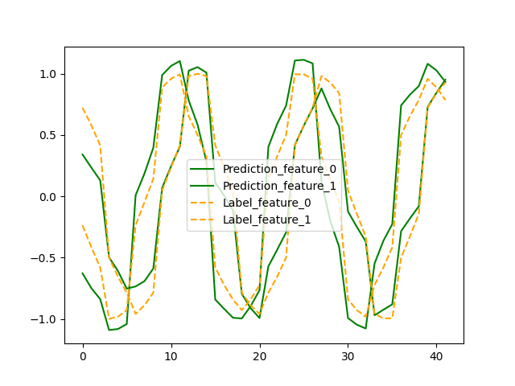

# TransformerMultiDimTimeForecast
 
Make a Transformer for time series forecasting with PyTorch

It is very very simple as there are only two modules.

I can't say that if I am right, just post it for beginner.

Comments have Chinese, sorry for others.

## Reference

https://github.com/KasperGroesLudvigsen/influenza_transformer

## Network Structure

Only two modules: 

1. Use `nn.Linear` to convert `[*, enc_feature_size] -> [*, d_model]`, `[*, dec_feature_size] -> [*, d_model]`, same in the opposite direction.

2. Use `nn.Transformer` in `output = model(src, tgt)`

    where `src: (S, N, E), tgt: (T, N, E), output: (T, N, E)`
    
    where `S` is the source sequence length, `T` is the target sequence length, `N` is the batch size, `E` is the feature number

Overall view in Network Structure:

```python
def forward(self, src: Tensor, tgt: Tensor, src_mask: Tensor = None,
                tgt_mask: Tensor = None) -> Tensor:
   src = self.encoder_input_layer(src) 
   src = self.positional_encoding_layer(src)
   src = self.encoder(src=src)
   decoder_output = self.decoder_input_layer(tgt)
   decoder_output = self.decoder(
               tgt=decoder_output,
               memory=src,
               tgt_mask=tgt_mask,
               memory_mask=src_mask
           )
   decoder_output = self.linear_mapping(decoder_output)
return decoder_output
```

## Usage

### Environment

Just PyCharm is ok. Other way to create venv is simple.

### Showcase

1. Run `Transformer\train_transformer.py` to train model.

2. Run `Transformer\test_transformer.py` to test model and get a plot showing prediction and label.

Result:



### Dataloader

When data is fetched from a csv, it is fetched line by line, and if DataLoader is used, one line is a batch.

Suppose dataloader is written as:

```python
train_loader = DataLoader(dataset_train, batch_size=batch_size, shuffle=False, drop_last=True)
```

For NLP, a row has three elements (three columns), and one element is a sentence, then after this element split is `enc_seq_len`, `dec_seq_len`.

Then the training loop should be written as:

```python
for idx, (enc_input, dec_input, dec_output) in enumerate(train_loader):
    # enc_input: [batch_size, enc_seq_len] 
    # dec_input: [batch_size, dec_seq_len] 
    # dec_output: [batch_size, dec_seq_len]
    ...
```

But for time prediction applications, a row is a timestamp, and an element (column) in a row is the value of a feature.

So for temporal prediction applications, a line should be one of `enc_seq_len`, `dec_seq_len`.

Then the training loop should be written as:

```python
for idx, (full_len_input, dec_output) in enumerate(train_loader):
    # full_len_input: [batch_size, enc_features_size] 
    # dec_output: [batch_size, dec_features_size]
    ...
```

So the `batch_size` of DataLoader is not the same as the `batch_size` in `output = transformer_model(src, tgt)`.

In pytorch, `output = transformer_model(src, tgt)` should be:

src: (S, E) for unbatched input, (S, N, E) if batch_first=False or (N, S, E) if batch_first=True.

tgt: (T, E) for unbatched input, (T, N, E) if batch_first=False or (N, T, E) if batch_first=True.

output: (T, E) for unbatched input, (T, N, E) if batch_first=False or (N, T, E) if batch_first=True.

where S is the source sequence length, T is the target sequence length, N is the batch size, E is the features number

So the `batch_size` of DataLoader should be converted into `S` and `T` of transformer.

As for specific element idx, see:

> That is, given the encoder input (x1, x2, …, x10) and the decoder input (x10, …, x13),
> 
> the decoder aims to output (x11, …, x14).

In this example, there is now `full_len_input` equivalent to `(x1, x2, ..., x14)`.

So need `enc_input = full_len_input.numpy()[:enc_seq_len]` to get `(x1, x2, ..., x10)`.

`dec_input = full_len_input.numpy()[enc_seq_len-1:enc_seq_len-1+dec_seq_len]` to get `(x10, …, x13)`

`dec_output = full_len_input.numpy()[enc_seq_len:enc_seq_len+dec_seq_len]` to get `(x11, …, x14)`

So actually `full_seq_len = enc_seq_len + dec_seq_len`.

And the `E` of transformer is actually `d_model`.

So if we want to input a custom `enc_features_size` output a custom `dec_features_size`, in fact, add two linear layers before and after the transformer.

Input linear layer `[:, enc_features_size] -> [:, d_model]`.

Output linear layers `[:, d_model] -> [:, dec_features_size]`.

### Paras to Modify

```python
# hyper parameters

enc_features_size = 2
dec_features_size = 2
batch_first = False
d_model = 128  # After embedding, the feature length of each element
num_encoder_layers = 4  # Number of encoder layers
num_decoder_layers = 4  # Number of decoder layers
n_heads = 8  # Number of attention heads
dropout_encoder = 0.2
dropout_decoder = 0.2
dropout_pos_enc = 0.1
dim_feedforward_encoder = 1024  # Dimensions of Feed Forward Layer in Encoder
dim_feedforward_decoder = 1024  # Dimensions of Feed Forward Layer in Decoder

lr = 0.001  # learning rate
```

### Way to Modify

1. Modify dataloader.

    My dataloader is just get line from csv, and I haven't made batch. You may have precise need.
    
2. Add modules and care for dimensions.

### Problems

1. Maybe must need `batch_size` in `output = transformer_model(src, tgt)`

   That means if you get `src: (S, E) tgt: (T, E)`, you may need to unsqueeze at dim = 1, and get `src: (S, 1, E) tgt: (T, 1, E)`.

   Or you may get error:
   
   ```
   File "/public/home/.../python3/lib/python3.8/site-packages/torch/nn/modules/transformer.py", line 134, in forward
   if src.size(2) != self.d_model or tgt.size(2) != self.d_model:
   IndexError: Dimension out of range(expected to be in range of[-2, 1], but got 2)
   ```
   
   This error only happen in my linux server, don't happen in my windows11 laptop. I have no idea about why pytorch must see `.size(2)`, but only thing I can do is add `batch_size`.

   
